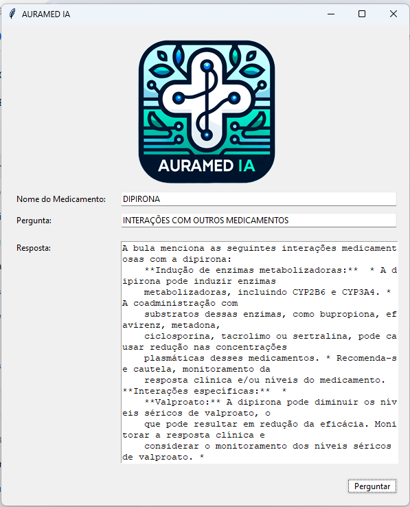

## Sobre o Projeto
<div align="center">
    
</div>
**AURAMED IA**  é uma ferramenta inovadora destinada a auxiliar profissionais da saúde a acessarem informações vitais sobre prescrições de medicamentos diretamente da base de dados da ANVISA. Utilizando tecnologia de ponta, o aplicativo busca automatizar a consulta a bulas e informações de medicamentos, proporcionando respostas rápidas e precisas.

## Tecnologias Utilizadas

* **Google Generative AI (Gemini):** Modelo de linguagem avançado que potencializa as funcionalidades de processamento de linguagem do aplicativo.
* **Técnicas de Prompt Engineering:** Foram utilizadas técnicas de few-shot learning e ajustes nos parâmetros de temperatura do LLM.


## Como Usar

1. **Clone o repositório:**

```bash
git clone https://github.com/thiago-maran/AURAMED-IA.git
```

2. **Instale as dependências:**

```bash
pip install -r my_app/requirements.txt
```

3. **Configure sua chave de API:**

    * Obtenha uma chave de API do Google Generative AI e substitua o valor de `API_KEY` no arquivo `app.py` pela sua chave.
